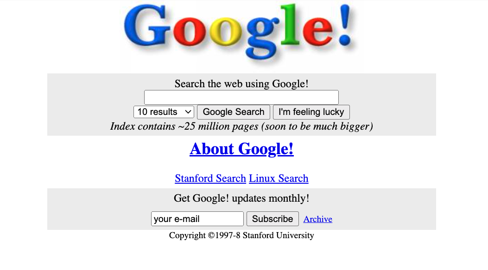

    

# TP Ouro 3.5 - O primeiro site do Google  

  

O primeiro site do Google foi ao ar em 1998.

Neste exercício **você deverá reconstruir a home-page desse website**, mostrada na imagem acima.

A (clássica) imagem utilizada na página está aqui neste projeto, num subdiretório de nome "images".
